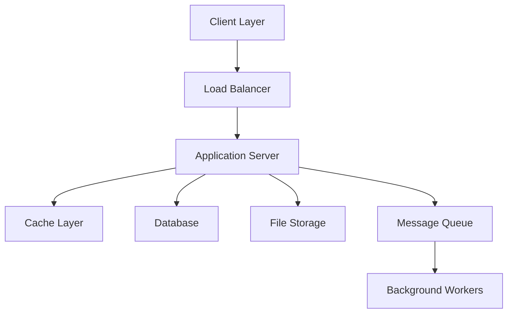
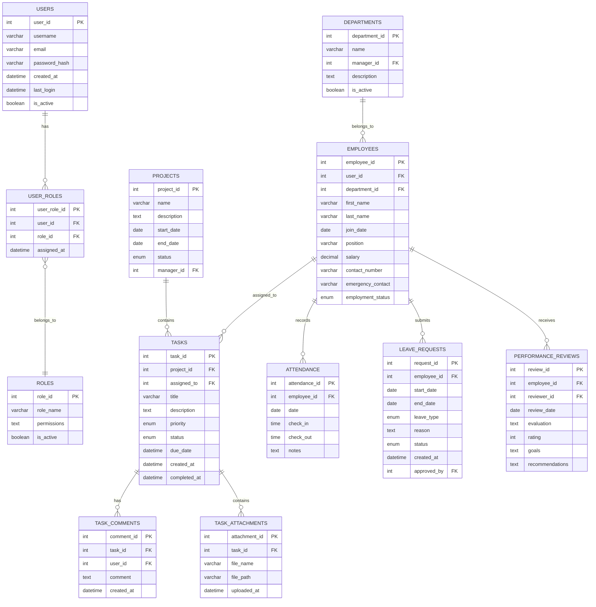

# Staff Management System - Complete Documentation

## Table of Contents
1. [Introduction](#introduction)
2. [System Architecture](#system-architecture)
3. [Database Design](#database-design)
4. [Core Modules](#core-modules)
5. [API Documentation](#api-documentation)
6. [Security Implementation](#security-implementation)
7. [User Interface](#user-interface)
8. [Deployment Guide](#deployment-guide)
9. [Testing Strategy](#testing-strategy)
10. [Maintenance & Support](#maintenance--support)
11. [Troubleshooting Guide](#troubleshooting-guide)
12. [Best Practices](#best-practices)

## 1. Introduction

### 1.1 System Overview
The Staff Management System is an enterprise-grade solution designed to streamline human resource management, task tracking, and organizational operations. This comprehensive system integrates various modules to provide a seamless experience for managing employees, tasks, attendance, and administrative functions.

### 1.2 Key Features
- Employee Management
- Task & Project Tracking
- Attendance Management
- Leave Management
- Performance Review System
- Document Management
- Reporting & Analytics
- Role-based Access Control
- Mobile Responsiveness
- Real-time Notifications

### 1.3 Target Users
- HR Administrators
- Department Managers
- Team Leaders
- Regular Employees
- System Administrators
- Executive Management

## 2. System Architecture

### 2.1 Technology Stack
- **Frontend**: 
  - React.js 18.x
  - Redux Toolkit
  - Tailwind CSS
  - Material-UI Components
  - Socket.io Client

- **Backend**:
  - Node.js 18.x
  - Express.js
  - MySQL 8.x
  - Redis (Caching)
  - Socket.io Server

- **DevOps**:
  - Docker
  - Kubernetes
  - Jenkins
  - AWS/Azure Services

### 2.2 System Components


### 2.3 Infrastructure Requirements
- **Minimum Server Requirements**:
  - CPU: 4 cores
  - RAM: 16GB
  - Storage: 500GB SSD
  - Network: 1Gbps

- **Scalability Considerations**:
  - Horizontal scaling capabilities
  - Load balancing configuration
  - Database replication
  - Caching strategies

## 3. Database Design

### 3.1 Entity Relationship Diagram


### 3.3 Data Dictionary
| Table Name | Column Name | Data Type | Constraints | Description |
|------------|-------------|-----------|-------------|-------------|
| users | user_id | INT | PK, AUTO_INCREMENT | Unique identifier |
| users | username | VARCHAR(50) | UNIQUE, NOT NULL | User login name |
| [Continue for all tables] |

## 4. Core Modules

### 4.1 Employee Management
#### Features
- Employee Profile Creation & Management
- Department Assignment
- Role Management
- Document Upload & Storage
- Employment History Tracking
- Salary Management
- Contact Information Management

#### Implementation Details
```javascript
// Employee Service Class
class EmployeeService {
    async createEmployee(employeeData) {
        // Validation
        const validatedData = await this.validateEmployeeData(employeeData);
        
        // Create user account
        const userAccount = await this.createUserAccount(validatedData);
        
        // Create employee profile
        const employeeProfile = await this.createEmployeeProfile(validatedData, userAccount.id);
        
        // Assign roles
        await this.assignDefaultRoles(userAccount.id);
        
        return employeeProfile;
    }
    
    // Other methods...
}
```

### 4.2 Task Management
#### Features
- Task Creation & Assignment
- Priority & Status Management
- Deadline Tracking
- File Attachments
- Comments & Collaboration
- Task Dependencies
- Progress Tracking

#### Implementation Details
```javascript
// Task Service Class
class TaskService {
    async createTask(taskData) {
        // Implementation details...
    }
    
    async updateTaskStatus(taskId, status) {
        // Implementation details...
    }
    
    // Other methods...
}
```

[Continue with all core modules...]

## 5. API Documentation

### 5.1 Authentication API
#### Login Endpoint
```javascript
/**
 * @api {post} /api/auth/login Login user
 * @apiName LoginUser
 * @apiGroup Authentication
 *
 * @apiParam {String} username User's username
 * @apiParam {String} password User's password
 *
 * @apiSuccess {String} token JWT token
 * @apiSuccess {Object} user User information
 */
```

[Continue with all API endpoints...]

## 6. Security Implementation

### 6.1 Authentication & Authorization
- JWT Token Implementation
- Password Hashing (bcrypt)
- Role-based Access Control
- Session Management
- API Rate Limiting

### 6.2 Data Protection
- Input Validation
- SQL Injection Prevention
- XSS Protection
- CSRF Protection
- Data Encryption

### 6.3 Security Best Practices
```javascript
// Security Middleware Example
const securityMiddleware = {
    rateLimit: {
        windowMs: 15 * 60 * 1000, // 15 minutes
        max: 100 // limit each IP to 100 requests per windowMs
    },
    
    csrf: {
        // CSRF configuration
    },
    
    helmet: {
        // Helmet security headers
    }
};
```

## 7. User Interface

### 7.1 Component Structure
```jsx
// Example Component Structure
const DashboardLayout = () => {
    return (
        <div className="dashboard-layout">
            <Sidebar />
            <MainContent>
                <Header />
                <Outlet />
                <Footer />
            </MainContent>
        </div>
    );
};
```

### 7.2 State Management
```javascript
// Redux Store Configuration
const store = configureStore({
    reducer: {
        auth: authReducer,
        employees: employeesReducer,
        tasks: tasksReducer,
        // Other reducers...
    },
    middleware: [thunk]
});
```

[Continue with all sections...]

## 8. Deployment Guide

### 8.1 Development Environment Setup
```bash
# Clone repository
git clone https://github.com/your-repo/staff-management-system.git

# Install dependencies
npm install

# Configure environment
cp .env.example .env

# Start development server
npm run dev
```

### 8.2 Production Deployment
```bash
# Build application
npm run build

# Docker build
docker build -t staff-management-system .

# Kubernetes deployment
kubectl apply -f k8s/
```

[Continue with deployment details...]

## 9. Testing Strategy

### 9.1 Unit Testing
```javascript
// Example Test Suite
describe('EmployeeService', () => {
    it('should create new employee', async () => {
        // Test implementation...
    });
    
    it('should update employee details', async () => {
        // Test implementation...
    });
});
```

### 9.2 Integration Testing
### 9.3 E2E Testing
### 9.4 Performance Testing

[Continue with all testing sections...]

## 10. Maintenance & Support

### 10.1 Monitoring
- System Health Monitoring
- Performance Monitoring
- Error Tracking
- Usage Analytics

### 10.2 Backup Strategy
- Database Backup Procedures
- File Storage Backup
- Disaster Recovery Plan

### 10.3 Update Procedures
- Version Control Guidelines
- Database Migration Procedures
- Deployment Procedures

## 11. Troubleshooting Guide

### 11.1 Common Issues
| Issue | Possible Cause | Solution |
|-------|---------------|----------|
| Login Failed | Invalid credentials | Check username and password |
| Slow Performance | Database queries | Optimize queries, check indexes |
| [Continue with common issues] |

### 11.2 Error Codes
| Code | Description | Resolution |
|------|-------------|------------|
| AUTH001 | Authentication failed | Verify credentials |
| AUTH002 | Token expired | Refresh token |
| [Continue with error codes] |

## 12. Best Practices

### 12.1 Coding Standards
- ESLint Configuration
- Code Formatting (Prettier)
- Documentation Requirements
- Code Review Process

### 12.2 Performance Optimization
- Caching Strategies
- Database Optimization
- Frontend Optimization
- API Optimization

### 12.3 Security Guidelines
- Password Requirements
- Access Control
- Data Protection
- Security Audits

---

## Appendix

### A. Glossary
| Term | Definition |
|------|------------|
| JWT | JSON Web Token |
| RBAC | Role-Based Access Control |
| [Continue with terms] |

### B. Change Log
| Version | Date | Changes |
|---------|------|---------|
| 1.0.0 | 2024-01-04 | Initial Release |
| [Continue with versions] |

### C. Contact Information
- Technical Support: support@company.com
- System Administrator: admin@company.com
- Emergency Contact: emergency@company.com

---

*Last Updated: January 4, 2024*
